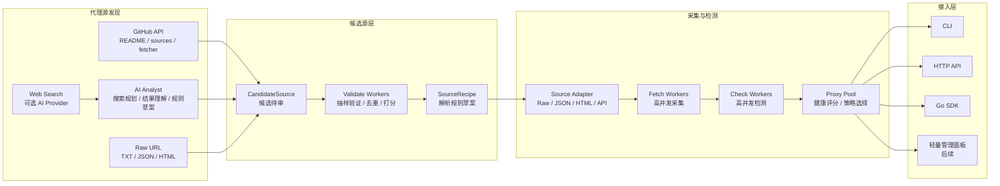

# plugproxy

plugproxy 是一个使用 Go 编写的轻量级代理采集、检测、代理池管理和接入工具。

> 当前状态：早期设计与项目初始化阶段。

## 目标

- 从多种免费代理源采集代理。
- 并发检测代理，并保留有价值的健康状态与元数据。
- 通过 CLI、HTTP API 和 Go SDK 让任何项目都能轻松接入代理池。
- 支持 GitHub、Web、Raw URL 和可选 AI 搜索发现候选代理源。
- 以 worker pool 支持高并发抓取、验证和检测。
- 保持轻量：单个 Go 二进制，无强制外部服务依赖。

## 架构



## 逻辑链

```text
discover -> candidates -> validate -> review -> source config -> fetch -> check -> pool -> CLI / HTTP API / SDK
```

plugproxy 的核心原则是“发现候选源”和“使用可用代理”分离。AI、GitHub 搜索和页面分析只进入候选源队列；代理必须经过抽样验证、采集、检测和健康评分后，才会进入代理池。

## 扩展点

- `AIProvider`：适配 OpenAI、Responses-compatible 服务，以及后续 Anthropic、Gemini、OpenRouter、Ollama 等。
- `Source`：适配 Raw TXT、JSON、HTML 表格、公开 API 和项目源码引用的页面型源。
- `Checker`：扩展 HTTP、HTTPS、SOCKS4、SOCKS5 和多目标检测。
- `Pool`：扩展内存池、持久化池、健康评分和选择策略。
- `Access`：扩展 CLI、HTTP API、Go SDK 和后续嵌入式前端管理面板。

## 当前命令

```bash
go run ./cmd/plugproxy version
go run ./cmd/plugproxy fetch -source-workers 32 -cache .plugproxy.cache.json
go run ./cmd/plugproxy list -source-workers 32 -cache .plugproxy.cache.json
go run ./cmd/plugproxy get -source-workers 32 -cache .plugproxy.cache.json -strategy fastest -protocol http
go run ./cmd/plugproxy check -source-workers 32 -cache .plugproxy.cache.json -workers 128 -protocol http -target https://httpbin.org/ip -timeout 8s
go run ./cmd/plugproxy run -source-workers 32 -cache .plugproxy.cache.json -addr 127.0.0.1:8899 -skip-check=false
go run ./cmd/plugproxy discover repo jhao104/proxy_pool -workers 32
go run ./cmd/plugproxy discover url https://raw.githubusercontent.com/gfpcom/free-proxy-list/main/sources/http.txt
go run ./cmd/plugproxy discover search -query "free proxy list socks5" -limit 10 -workers 32
go run ./cmd/plugproxy discover validate candidates.json -workers 128
```

运行后可用的 HTTP API：

```text
GET /health
GET /sources
GET /proxies
GET /proxy
GET /proxy?protocol=http
GET /proxy?strategy=fastest
GET /proxy?strategy=fastest&protocol=http&healthy=true
```

## 健康评分

`check` 会按协议检测代理并更新内存代理池中的健康状态：

- HTTP/HTTPS：使用标准库 HTTP Transport 检测。
- SOCKS5：使用 Go 官方扩展包 `golang.org/x/net/proxy` 检测。
- SOCKS4：第一版明确标记为 unsupported，不参与健康代理判断。

健康字段包括 `health_score`、`health_status`、`check_count`、`consecutive_failures`、`last_success_at`、`last_failure_at` 和 `last_error`。

状态分级：

- `unchecked`：尚未检测。
- `healthy`：分数较高且最近一次检测成功。
- `degraded`：可疑或分数中等。
- `dead`：连续失败或分数过低。

当前健康状态保存在内存中。独立执行一次 `check` 后，结果不会自动带到下一次独立执行的 `get`；需要长期复用健康池时，应使用 `run -skip-check=false` 启动常驻服务，后续再通过 HTTP API 获取代理。

## 代理源配置

默认会读取 `plugproxy.sources.json`。如果文件不存在，plugproxy 会启用内置的第一批高优先级 Raw/API TXT 源。

配置示例见 [plugproxy.sources.example.json](plugproxy.sources.example.json)：

```json
{
  "sources": [
    {
      "name": "proxyscrape-http",
      "type": "raw_text_url",
      "url": "https://api.proxyscrape.com/v4/free-proxy-list/get?request=display_proxies&protocol=http&proxy_format=ipport&format=text",
      "protocol_hint": "http",
      "enabled": true,
      "timeout": "12s",
      "body_limit": 2097152
    }
  ]
}
```

第一版配置源只支持 `type: "raw_text_url"`，可解析 `ip:port` 和 `protocol://ip:port`。

## 采集缓存

`fetch/list/get/check/run` 默认会把成功采集到的代理写入 `.plugproxy.cache.json`。当一轮采集所有源都失败时，会自动回退读取缓存，避免免费源短暂超时导致代理池为空。

`fetch` 会输出本轮源级采集报告，包括成功源、失败源、去重数量、缓存是否被复用和每个源耗时。HTTP API 的 `GET /sources` 会返回最近一次采集报告。

## 项目结构

```text
cmd/plugproxy/       CLI 入口
internal/app/        应用编排
internal/cache/      代理缓存
internal/checker/    代理检测
internal/config/     代理源配置和默认源
internal/fetcher/    并发代理源采集
internal/pool/       代理池接口与内存实现
internal/server/     轻量 HTTP API
internal/source/     代理源接口与实现
internal/discover/   代理源发现、验证和 AI Provider
pkg/model/           公开代理数据模型
docs/                项目文档
```

## 文档

- [项目约定](docs/project-conventions.md)
- [GitHub Actions CI/CD](docs/ci-cd.md)
- [代理源清单](docs/proxy-sources.md)
- [代理源发现爬虫设计](docs/source-discovery.md)
- [开发路线图](docs/roadmap.md)
