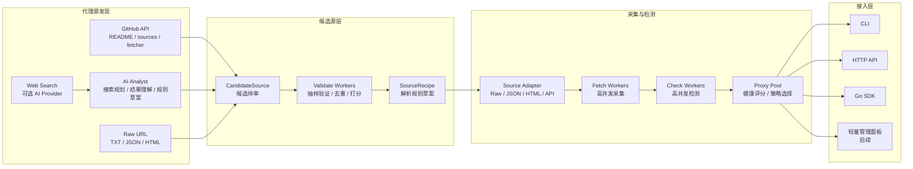

# plugproxy

plugproxy 是一个使用 Go 编写的轻量级代理采集、检测、代理池管理和接入工具。

> 当前状态：v0.2.0 可用预览版。

## 目标

- 从多种免费代理源采集代理。
- 并发检测代理，并保留有价值的健康状态与元数据。
- 通过 CLI、HTTP API 和 Go SDK 让任何项目都能轻松接入代理池。
- 支持 GitHub、Web、Raw URL 和可选 AI 搜索发现候选代理源。
- 以 worker pool 支持高并发抓取、验证和检测。
- 保持轻量：单个 Go 二进制，无强制外部服务依赖。

## 安装

从 GitHub Releases 下载适合系统的压缩包，解压后把 `plugproxy` 或 `plugproxy.exe` 放到 `PATH` 中。

```bash
plugproxy version
plugproxy init
plugproxy doctor
```

也可以直接从源码运行：

```bash
go run ./cmd/plugproxy version
go run ./cmd/plugproxy init
go run ./cmd/plugproxy doctor
```

## 快速开始

```bash
plugproxy init
plugproxy doctor
plugproxy fetch -source-workers 32 -per-host-workers 4 -cache .plugproxy.cache.json
plugproxy check -source-workers 32 -cache .plugproxy.cache.json -workers 128 -protocol http -target https://httpbin.org/ip -timeout 8s -max-checks 0 -check-ttl 0s
plugproxy get -cache .plugproxy.cache.json -strategy fastest -protocol http -healthy=true
plugproxy run -source-workers 32 -per-host-workers 4 -cache .plugproxy.cache.json -addr 127.0.0.1:8899 -skip-check=false -refresh=true -refresh-interval 5m -refresh-min-interval 30s -refresh-max-interval 30m
```

Go 项目接入见 [Go SDK 接入](docs/sdk.md)。

## 架构



## 逻辑链

```text
discover -> candidates -> validate -> review -> source config -> fetch -> check -> pool -> CLI / HTTP API / SDK
```

plugproxy 的核心原则是“发现候选源”和“使用可用代理”分离。AI、GitHub 搜索和页面分析只进入候选源队列；代理必须经过抽样验证、采集、检测和健康评分后，才会进入代理池。

## 扩展点

- `AIProvider`：适配 OpenAI、Responses-compatible 服务，以及后续 Anthropic、Gemini、OpenRouter、Ollama 等。
- `Source`：适配 Raw TXT、JSON、HTML 表格、公开 API 和项目源码引用的页面型源。
- `Checker`：扩展 HTTP、HTTPS、SOCKS4、SOCKS5 和多目标检测。
- `Pool`：扩展内存池、持久化池、健康评分和选择策略。
- `Access`：扩展 CLI、HTTP API、Go SDK 和后续嵌入式前端管理面板。

## 当前命令

```bash
go run ./cmd/plugproxy version
go run ./cmd/plugproxy init
go run ./cmd/plugproxy doctor
go run ./cmd/plugproxy fetch -source-workers 32 -per-host-workers 4 -cache .plugproxy.cache.json
go run ./cmd/plugproxy list -source-workers 32 -cache .plugproxy.cache.json
go run ./cmd/plugproxy get -source-workers 32 -cache .plugproxy.cache.json -strategy fastest -protocol http -healthy=true
go run ./cmd/plugproxy stats -cache .plugproxy.cache.json
go run ./cmd/plugproxy check -source-workers 32 -per-host-workers 4 -cache .plugproxy.cache.json -workers 128 -protocol http -target https://httpbin.org/ip -timeout 8s -max-checks 0 -check-ttl 0s
go run ./cmd/plugproxy run -source-workers 32 -per-host-workers 4 -source-cooldown 15m -cache .plugproxy.cache.json -addr 127.0.0.1:8899 -skip-check=false -refresh=true -refresh-interval 5m -refresh-min-interval 30s -refresh-max-interval 30m -max-checks 0 -check-ttl 0s
go run ./cmd/plugproxy discover repo jhao104/proxy_pool -workers 32
go run ./cmd/plugproxy discover url https://raw.githubusercontent.com/gfpcom/free-proxy-list/main/sources/http.txt
go run ./cmd/plugproxy discover search -query "free proxy list socks5" -limit 10 -workers 32
go run ./cmd/plugproxy discover validate candidates.json -workers 128 -per-host-workers 4 -write-sources plugproxy.sources.candidates.json
```

运行后可用的 HTTP API：

```text
GET /health
GET /sources
GET /refresh
POST /refresh
GET /stats
GET /proxies
GET /proxies?protocol=http&status=healthy&limit=100&offset=0
GET /proxy
GET /proxy?protocol=http
GET /proxy?strategy=fastest
GET /proxy?strategy=fastest&protocol=http&healthy=true
```

## 健康评分

`check` 会按协议检测代理并更新内存代理池中的健康状态：

- HTTP/HTTPS：使用标准库 HTTP Transport 检测。
- SOCKS5：使用 Go 官方扩展包 `golang.org/x/net/proxy` 检测。
- SOCKS4：第一版明确标记为 unsupported，不参与健康代理判断。

健康字段包括 `health_score`、`health_status`、`check_count`、`consecutive_failures`、`last_success_at`、`last_failure_at` 和 `last_error`。

状态分级：

- `unchecked`：尚未检测。
- `healthy`：分数较高且最近一次检测成功。
- `degraded`：可疑或分数中等。
- `dead`：连续失败或分数过低。

健康状态会写入 `.plugproxy.cache.json`，独立执行一次 `check` 后，下一次 `get/list/run` 会复用历史健康评分。

`check` 和 `run` 支持轻量检测调度：`-check-ttl` 可跳过最近检测过的代理，`-max-checks` 可限制单轮检测数量。默认 `-check-ttl 0s -max-checks 0` 表示保持全量检测。

## 代理源配置

默认会读取 `plugproxy.sources.json`。如果文件不存在，plugproxy 会启用内置的第一批高优先级 Raw/API TXT 源。

配置示例见 [plugproxy.sources.example.json](plugproxy.sources.example.json)：

```json
{
  "sources": [
    {
      "name": "proxyscrape-http",
      "type": "raw_text_url",
      "url": "https://api.proxyscrape.com/v4/free-proxy-list/get?request=display_proxies&protocol=http&proxy_format=ipport&format=text",
      "protocol_hint": "http",
      "enabled": true,
      "timeout": "12s",
      "body_limit": 2097152
    }
  ]
}
```

当前运行时支持 `raw_text_url`、`json_url` 和 `api_url`：

- `raw_text_url`：解析 `ip:port` 和 `protocol://ip:port`。
- `json_url`：解析字符串数组、对象数组，以及 `data/items/results/proxies` 等根对象数组。
- `api_url`：第一版按 JSON API 处理，可通过 `headers` 设置 `Accept`、`User-Agent` 等公开 API 请求头。

JSON/API 字段映射可用 `json.items_path`、`json.proxy_field`、`json.host_field`、`json.port_field`、`json.protocol_field` 做轻量覆盖；`items_path` 只支持单层 key。更完整的源接入说明见 [代理源清单](docs/proxy-sources.md)。

## 采集缓存

`fetch/list/get/check/run` 默认会把成功采集到的代理写入 `.plugproxy.cache.json`。当一轮采集所有源都失败时，会自动回退读取缓存，避免免费源短暂超时导致代理池为空。

`fetch` 会输出本轮源级采集报告，包括成功源、失败源、冷却跳过源、去重数量、错误分类、缓存是否被复用和每个源耗时。连续失败源会进入短期冷却，同一 host 的源请求也会受 `-per-host-workers` 限制。HTTP API 的 `GET /sources` 会返回最近一次采集报告。

缓存也会保留检测后的健康字段。缓存中的代理与新采集代理按 `protocol://address` 合并；新代理首次出现时初始化为 `unchecked` 和 50 分，已存在代理再次出现时保留历史健康评分。

## 自动刷新

`run` 默认开启动态刷新控制器。`-refresh-interval` 是基础间隔，不是写死节拍；控制器会根据健康代理水位、unchecked 积压、上一轮失败情况和抖动计算下一次刷新。刷新会在源返回后尽快去重、调度检测并入池，不必等待所有源都抓取完成；最终仍只写一次 cache。可用 `-refresh=false` 关闭，或用 `-refresh-min-interval`、`-refresh-max-interval`、`-min-healthy` 等参数调整策略。

`GET /refresh` 会显示当前 `phase`、进度、跳过原因、下一次刷新时间和最近一次 pipeline 报告；重复 `POST /refresh` 不会重入正在运行的 refresh。

刷新任务串行执行，上一轮未结束时会跳过新一轮。HTTP API 提供：

```text
POST /refresh  异步触发一次刷新
GET /refresh   查看最近一次刷新状态
```

## Go SDK

推荐外部项目通过 `pkg/client` 连接常驻 plugproxy 服务：

```go
c := client.New("http://127.0.0.1:8899")
p, err := c.GetProxy(ctx, client.GetProxyOptions{
	Strategy: "fastest",
	Protocol: model.ProtocolHTTP,
	Healthy:  true,
})
```

需要业务进程自带代理池时，可以使用 `pkg/plugproxy` 启动嵌入式服务。详细示例见 [Go SDK 接入](docs/sdk.md)。

## 项目结构

```text
cmd/plugproxy/       CLI 入口
internal/app/        应用编排
internal/cache/      代理缓存
internal/checker/    代理检测
internal/config/     代理源配置和默认源
internal/fetcher/    并发代理源采集
internal/pool/       代理池接口与内存实现
internal/server/     轻量 HTTP API
internal/source/     代理源接口与实现
internal/discover/   代理源发现、验证和 AI Provider
pkg/model/           公开代理数据模型
docs/                项目文档
```

## 文档

- [项目约定](docs/project-conventions.md)
- [GitHub Actions CI/CD](docs/ci-cd.md)
- [发布流程](docs/release.md)
- [代理源清单](docs/proxy-sources.md)
- [代理源发现爬虫设计](docs/source-discovery.md)
- [并发能力设计备忘](docs/concurrency.md)
- [Go SDK 接入](docs/sdk.md)
- [开发路线图](docs/roadmap.md)
